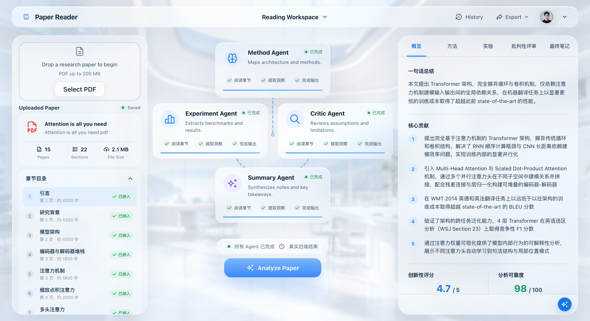

# Multi-Agent Paper Reader

**English** | [简体中文](./README.zh-CN.md)

Multi-Agent Paper Reader is an evidence-grounded research paper reading assistant. Upload a PDF, parse its sections, build a traceable evidence index from text, extracted tables, and vision-model figure summaries, run specialist agents for method analysis, experiment analysis, and critique, then synthesize a polished structured reading note.



## Web App

The repository includes a full-stack web app:

- Backend: `app.py` with FastAPI
- Frontend: `frontend-prototype/` with React + Vite
- API: `POST /api/analyze` accepts a PDF upload and returns parsed paper metadata plus all agent outputs
- Streaming API: `POST /api/analyze/stream` returns newline-delimited JSON events for parsing, evidence indexing, token-level model output, agent completion, and final synthesis
- Follow-up API: `POST /api/chat/stream` combines recent turns, a compact long-term memory index, query-relevant topic memories, recalled older messages, and full-text paper evidence
- Conversation API: `GET/POST /api/history/{id}/conversations` plus `GET/PATCH/DELETE /api/chat/conversations/{id}` support multiple persistent chats per paper
- History API: `GET /api/history`, `GET /api/history/{id}`, and `DELETE /api/history/{id}` persist and restore completed analyses
- Section titles: common headings use a local Chinese dictionary; unknown English headings are translated in one bounded GLM batch before Live analysis starts
- Static hosting: the FastAPI server serves the built React app from `frontend-prototype/dist`

Run it locally:

```bash
# Python backend dependencies
python -m venv .venv
.\.venv\Scripts\python.exe -m pip install -r requirements.txt

# Frontend dependencies and production build
cd frontend-prototype
npm install
npm run build
cd ..

# Start the full-stack app
.\.venv\Scripts\python.exe -m uvicorn app:app --host 127.0.0.1 --port 8000
```

Open:

```text
http://127.0.0.1:8000/
```

For real LLM analysis, copy `.env.example` to `.env` and set `GLM_API_KEY`. The default provider is Zhipu GLM at `https://open.bigmodel.cn/api/paas/v4`, using `glm-5.2`. Agent generation uses `LLM_TEMPERATURE`; grounded follow-up chat has its own lower `CHAT_TEMPERATURE` (default `0.25`). `CHAT_INPUT_TOKEN_BUDGET` sets the conservative dynamic input budget used to balance evidence, recent turns, and long-term memory (default `48000`).

For figure/chart understanding, set `ENABLE_VISION_SUMMARY=true` and `VISION_MODEL_NAME=glm-5v-turbo` or another OpenAI-compatible vision model. The backend renders PDF visual regions to PNG, fans out one concurrent vision request per selected figure/chart by default, asks the vision model for concise Chinese visual summaries, and indexes them as `F` evidence. If the provider returns rate-limit errors, failed figures are automatically retried with the smaller `VISION_RETRY_WORKERS` pool.

## CLI Quick Start

```bash
pip install -r requirements.txt
copy .env.example .env
# Edit .env and set GLM_API_KEY

python main.py examples/your_paper.pdf --pretty
```

## Architecture

```text
PDF
-> core.pdf_parser.parse_pdf
-> core.evidence.build_evidence_index
-> MethodAgent + ExperimentAgent + CriticAgent read relevant text/table/figure evidence snippets
-> SummaryAgent synthesizes structured notes with carried-forward evidence
-> structured reading note
```

The live stream emits these event types:

- `paper`
- `evidence_index`
- `vision_started`
- `vision_complete`
- `vision_error`
- `agent_started`
- `agent_token`
- `agent_complete`
- `complete`
- `error`

`agent_token` is the raw model generation stream. The frontend shows it as a live preview, then renders the parsed Pydantic output once the JSON object is complete.

## Explainable Assessment

Every completed API response includes an `assessment` object with two separate results:

- **Novelty (1-5):** the Critic Agent scores problem originality (15%), method originality (40%), difference from prior work (30%), and generality (15%). The backend calculates the weighted total and keeps each reason and supporting evidence ID.
- **Analysis reliability (0-100):** the backend deterministically scores PDF parsing (20), key-section coverage (35), valid evidence citations (30), and structured-output integrity (15).

Reliability is not the model's self-reported confidence. Missing related-work coverage, fewer than three valid citations, insufficient parsed content, incomplete novelty dimensions, or Demo mode apply explicit score caps. The response exposes the component scores, raw score, cap, final score, and warnings so the result can be audited.

## Follow-up Chat

Open the paper chat directly from the AI button at the bottom-right of the results panel, or select text and choose **在侧边聊天中提问** to include that excerpt. Each paper can have multiple independent conversations, selectable from the chat header. Every original user and assistant message is stored in SQLite and restored after browser refreshes or backend restarts.

The long-conversation design follows the public Claude Code memory pattern: a concise memory index is loaded on every turn, while detailed topic memories are recalled only when relevant. The latest six complete rounds remain verbatim. Once another six older rounds become eligible, a background GLM task compacts them into the memory index and topic records without deleting the original messages or delaying the current answer. Each question can additionally recall relevant older original messages. A dynamic token budget prioritizes the current question, selected excerpt, original paper evidence, recent turns, analysis context, memory, and external sources instead of relying on a fixed message-count cutoff.

Each completed Live analysis returns an opaque `analysis_id`; the backend keeps that analysis's complete `E`/`T`/`F` evidence snippets in a bounded four-hour in-memory cache. For every question it combines Chinese/English query terms, conversational context, Agent-cited evidence IDs, and section intent to retrieve the most relevant original snippets. The answer prompt treats original paper evidence as authoritative, cites evidence IDs and pages, and explicitly distinguishes paper facts, background knowledge, memory, and inference.

Questions that explicitly ask for recent work, related papers, or comparisons with other papers can also use Semantic Scholar title/abstract metadata. This lookup is optional and fails closed; `SEMANTIC_SCHOLAR_API_KEY` can be configured for a dedicated API quota. Sample and Demo results use a deterministic reply so the complete interaction can be tested without another model call. Live in-memory chat sessions are recreated from persisted full evidence whenever a saved paper is reopened.

## Paper History

Every completed upload is saved locally in `.paper-reader/` by default. The SQLite database contains paper metadata, structured Agent outputs, assessment results, complete evidence snippets, chat conversations, immutable original messages, memory indexes, and topic memories; the original PDF is retained in `.paper-reader/papers/`. Uploading the same PDF again updates its existing history record instead of creating a duplicate. `Recent Papers` and the header History menu read this database, so a saved analysis and all of its conversations can be reopened after a browser refresh or backend restart without uploading the PDF again. Reopening a Live result recreates its grounded evidence session from the saved evidence.

Set `PAPER_READER_DATA_DIR` to move all history storage, or set `PAPER_HISTORY_DB` to choose a specific SQLite path. Deleting an item from the History menu removes both its database record and retained PDF.

See [CLAUDE.md](./CLAUDE.md) for the original architecture notes.

## Tech Stack

- LangGraph for agent orchestration
- PyMuPDF for PDF parsing, outline-based section detection, table extraction, and rendered figure regions
- Pydantic v2 for output schema validation
- Evidence snippets for page/section-grounded claims (`E` text, `T` table, `F` vision figure summary)
- FastAPI for the backend API and static hosting
- React + Vite for the frontend workbench
