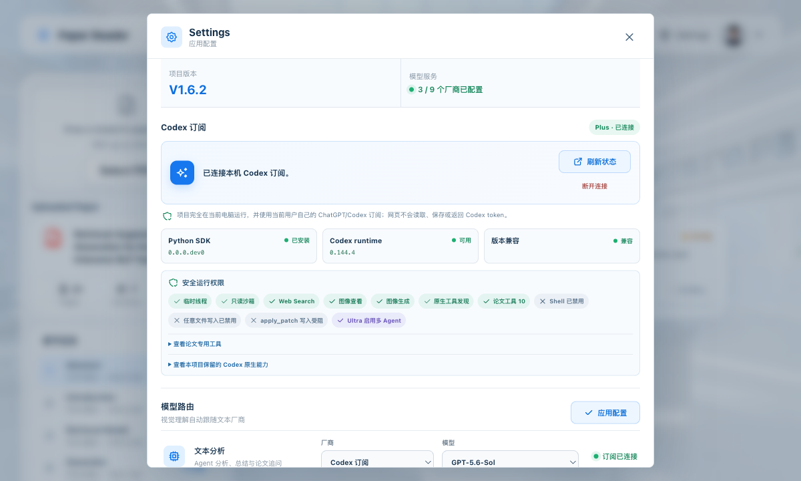
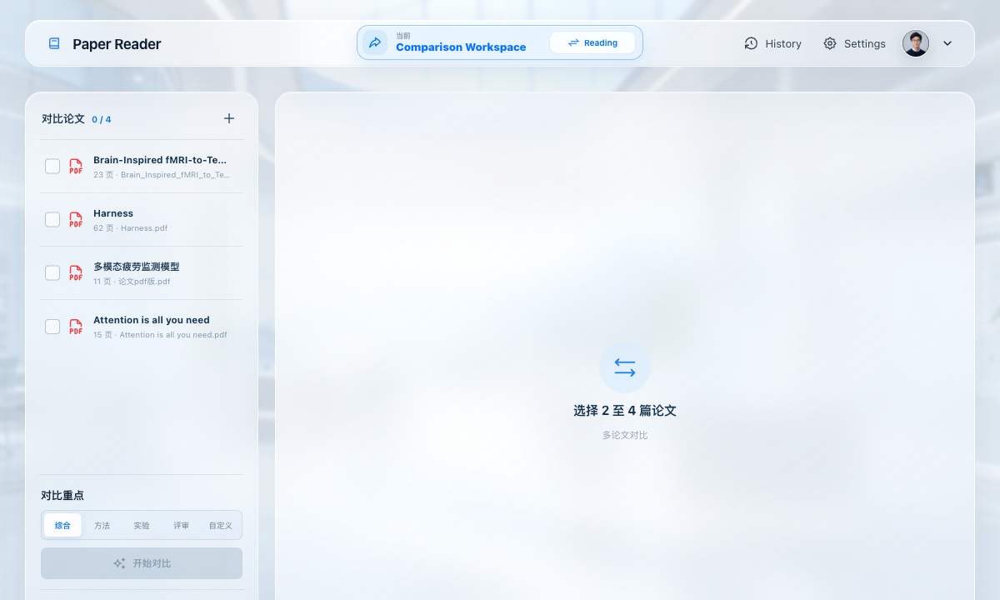

# Multi-Agent Paper Reader

**English** | [简体中文](./README.zh-CN.md)

A local AI workspace for reading academic papers. Upload a PDF and the app combines text, table, and visual evidence with specialist agents to produce structured, traceable notes that you can question and compare.


## What it does

- **Multi-agent analysis** — Method, Experiment, Critic, and Summary agents collaborate on one paper.
- **Figures, tables, and formulas** — understands structured and visual PDF content while preserving high-resolution exports.
- **Grounded paper chat** — follow-up answers are constrained by retrieved sections, pages, and evidence.
- **Multi-paper comparison** — compare methods, experiments, conclusions, and research gaps across 2–4 saved papers.
- **Explainable assessment** — separates paper novelty from analysis reliability and keeps the scoring evidence and warnings.
- **Local history and memory** — papers, analyses, conversations, and long-term memory stay under `.paper-reader/`.
- **Flexible model routing** — supports GLM, DeepSeek, OpenAI, Qwen, Doubao, Anthropic, Kimi, custom relays, and a local Codex subscription.

## Interface preview

Model routing and Codex subscription:



Multi-paper comparison workspace:



## Quick start

Python 3.10+ is required. Source installs should use Node.js 22; the formal Release ZIP already includes a built frontend.

### Windows

```powershell
git clone https://github.com/Lovenndme/multi-agent-paper-reader.git
cd multi-agent-paper-reader
powershell -ExecutionPolicy Bypass -File .\scripts\update.ps1
.\.venv\Scripts\python.exe -m uvicorn app:app --host 127.0.0.1 --port 8000
```

### macOS / Linux

```bash
git clone https://github.com/Lovenndme/multi-agent-paper-reader.git
cd multi-agent-paper-reader
bash ./scripts/update.sh
./.venv/bin/python -m uvicorn app:app --host 127.0.0.1 --port 8000
```

Open [http://127.0.0.1:8000](http://127.0.0.1:8000), configure a model in **Settings**, and upload a PDF.

Users who do not need a Git checkout can download the formal package from [GitHub Releases](https://github.com/Lovenndme/multi-agent-paper-reader/releases/latest).

## Use a Codex subscription

The local app can use the current user's ChatGPT/Codex subscription without an OpenAI API key:

1. Open **Settings → Codex Subscription**.
2. Reuse an existing local session or sign in through the browser/device-code flow.
3. Select a Codex model and reasoning level in model routing.

Authentication is handled by the official runtime. The web UI never reads, stores, or returns the Codex token. This route is designed only for a trusted single-user app accessed through `localhost`, not a public multi-user deployment.

See [Codex subscription integration](./docs/codex-subscription.md) for the model catalog, tool permissions, and security boundaries.

## Data and privacy

- Original PDFs, analyses, chats, and memories are stored locally in `.paper-reader/`.
- API keys are written only to the local `.env` and are never returned to the browser.
- Paper content is sent to the third-party model provider selected by the user.
- Codex, API providers, and custom relays never override one another automatically; the selected route is authoritative.

## Update

Stop the old service, then run:

```bash
# macOS / Linux
bash ./scripts/update.sh
```

```powershell
# Windows
powershell -ExecutionPolicy Bypass -File .\scripts\update.ps1
```

The updater preserves `.env` and `.paper-reader/`, reinstalls dependencies, rebuilds the frontend, and enforces frontend/backend version consistency. Restart the service when it finishes.

## CLI

```bash
./.venv/bin/python main.py path/to/paper.pdf --pretty
```

On Windows:

```powershell
.\.venv\Scripts\python.exe main.py path\to\paper.pdf --pretty
```

## Tech stack

FastAPI · React · Vite · LangGraph · Pydantic · PyMuPDF4LLM · FastEmbed · OpenAI Codex Python SDK

See [AGENTS.md](./AGENTS.md) for development, testing, and release rules. See [Releases](https://github.com/Lovenndme/multi-agent-paper-reader/releases) for version history.
